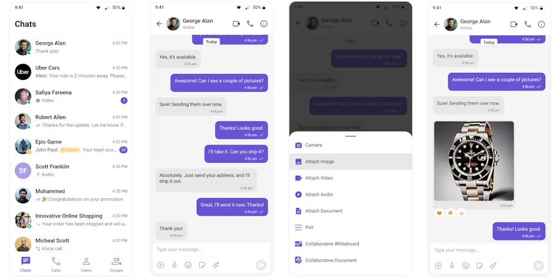

<p align="center">
  
</p>

# CometChat Chat SDK for Flutter

The CometChat Flutter SDK provides a robust toolkit to add real-time chat functionality to your Flutter applications. It handles the complexity of building chat infrastructure so you can focus on your app.

<p align="center">
  
</p>

## Prerequisites

- Flutter >= 3.10.5
- Dart >= 3.0.5
- Android Studio 2022.2+
- Android 5.0 (API 21) and above
- Xcode 15+
- iOS 12.0 and above

## Getting Started

### 1. Create a CometChat Account

- Sign up at the [CometChat Dashboard](https://app.cometchat.com/)
- Create a new app
- Note your **App ID**, **Auth Key**, and **Region**

### 2. Install the SDK

Add the CometChat SDK dependency to your `pubspec.yaml`:

```yaml
dependencies:
  cometchat_sdk:
    hosted:
      url: https://dart.cloudsmith.io/cometchat/cometchat/
    version: 5.0.0-beta.1
```

Then run:

```bash
flutter pub get
```

### 3. Initialize CometChat

```dart
import 'package:cometchat_sdk/cometchat_sdk.dart';

AppSettings appSettings = (AppSettingsBuilder()
  ..subscriptionType = CometChatSubscriptionType.allUsers
  ..region = "YOUR_REGION"
  ..autoEstablishSocketConnection = true
).build();

CometChat.init("YOUR_APP_ID", appSettings,
  onSuccess: (String successMessage) {
    debugPrint("Initialization completed successfully");
  },
  onError: (CometChatException e) {
    debugPrint("Initialization failed: ${e.message}");
  },
);
```

### 4. Log In a User

```dart
CometChat.login("USER_ID", "YOUR_AUTH_KEY",
  onSuccess: (User user) {
    debugPrint("Login successful: $user");
  },
  onError: (CometChatException e) {
    debugPrint("Login failed: ${e.message}");
  },
);
```

> For production apps, use [Auth Tokens](https://www.cometchat.com/docs/sdk/flutter/5.0/authentication-overview#login-using-auth-token) instead of Auth Keys.

### 5. Send a Message

```dart
TextMessage textMessage = TextMessage(
  text: "Hello!",
  receiverUid: "RECEIVER_UID",
  receiverType: CometChatReceiverType.user,
);

CometChat.sendMessage(textMessage,
  onSuccess: (TextMessage message) {
    debugPrint("Message sent: ${message.text}");
  },
  onError: (CometChatException e) {
    debugPrint("Message sending failed: ${e.message}");
  },
);
```

## Documentation

- [SDK Overview](https://www.cometchat.com/docs/sdk/flutter/5.0/overview)
- [Setup Guide](https://www.cometchat.com/docs/sdk/flutter/5.0/setup)
- [Authentication](https://www.cometchat.com/docs/sdk/flutter/5.0/authentication-overview)
- [Messaging](https://www.cometchat.com/docs/sdk/flutter/5.0/messaging-overview)

## Changelog

See [CHANGELOG.md](./CHANGELOG.md) for a detailed list of changes across versions.

## Help and Support

- [Documentation](https://www.cometchat.com/docs/sdk/flutter/5.0/overview)
- [Support Tickets](https://help.cometchat.com/hc/en-us)
- [CometChat Dashboard](https://app.cometchat.com/)

## License

Copyright (c) 2023 CometChat Inc. See [LICENSE](./LICENSE) for details.
